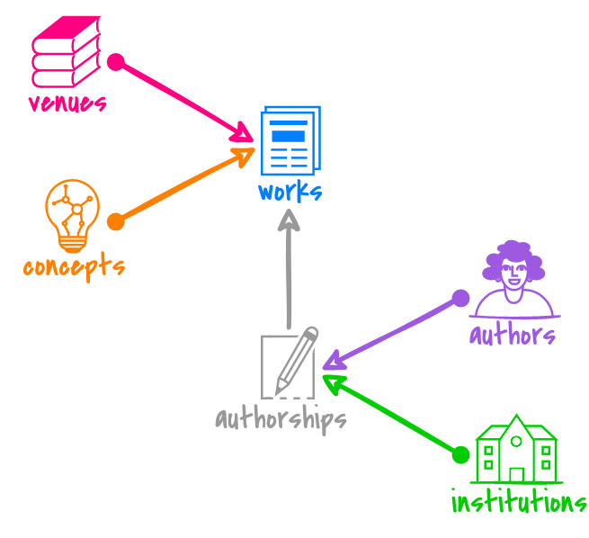

# OpenAlex API tutorials

A collection of Jupyter notebooks, each walking you through a common example of bibliometric analysis
using scholarly data from the [OpenAlex API](https://docs.openalex.org/). (:warning: Work In Progress).

## :bulb: What is OpenAlex?
[OpenAlex](https://openalex.org/) is a fully-open index of scholarly works, authors, venues, institutions, and concepts
— along with all the ways they're connected to one another.
It's named after the ancient [Library of Alexandria](https://en.wikipedia.org/wiki/Library_of_Alexandria)
and made by the nonprofit [OurResearch](https://ourresearch.org/).

What makes OpenAlex stand out as a bibliographic data source is its Openness:
* The data is made available under the [CC0 license](https://creativecommons.org/publicdomain/zero/1.0/).
  That means it's in the public domain, and free to use in any way you like.

* The primary way to access the data, is the [API](https://docs.openalex.org/#access).
  It is free and requires no authentication.

## :notebook: What are Jupyter notebooks?
Jupyter notebooks are documents that let you combine executable code snippets
with explanatory text, formulas and visualizations.
Weaving both of them together allows to craft a narrative around the *How?* and *Why?*
of one's programming work which makes them especially useful for writing up documentation and tutorials.
But not only that:
you can also dive right in by modifying and re-running code snippets as needed.
Therefore a notebook may serve as a starting point to prototype your own idea!

## :rocket: How do I run the notebooks?
*Note: You can browse through and read the notebooks right here on GitHub. However, the code snippets won't be executable.*

The easiest way to run Jupyter notebooks is via cloud services like [Binder](https://mybinder.org/),
[Google’s Colaboratory](https://colab.research.google.com/) or [Deepnote](https://deepnote.com/).
They provide you with a free execution environment that you can access directly in your browser - no setup needed.
Just click on one of the badges at the top of this README and it will take you to the selected service.

Alternatively you can set up a Jupyter server on your computer 
(for instructions please refer to the [official Jupyter docs](https://docs.jupyter.org/en/latest/install.html)).  
Many IDEs also support running Jupyter notebooks out of the box or via a plugin. If you have one installed, 
it may be a good idea to consult its docs or marketplace.
If you go local, though, please remember to install the Python packages specified in the `requirements.txt` file.

## :book: Citation
If you use OpenAlex in your research, please cite this paper:
> Priem, J., Piwowar, H., & Orr, R. (2022). _OpenAlex: A fully-open index of scholarly works, authors, venues, institutions, and concepts._ ArXiv. https://arxiv.org/abs/2205.01833

and don't forget to [tell us](https://docs.openalex.org/#contact) about your project. We love to hear what you come up with using data from OpenAlex!
